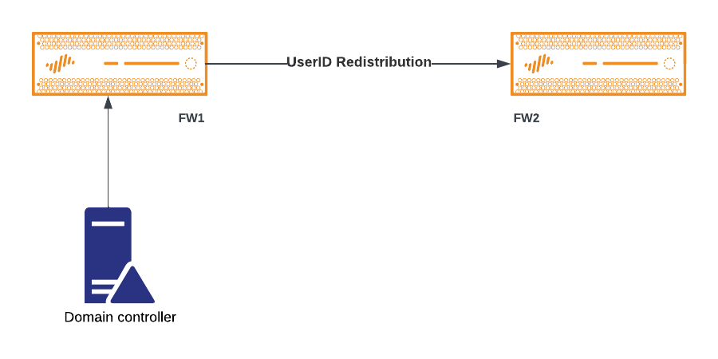

# Data Redistribution

### Example Diagram

In this example we will redistribute user information gathered by FW1 from a Domain Controller (see [User ID Agent](./userid.md) ) to FW2 like shown on the following diagram.

<figure><figcaption></figcaption></figure>

### FW1 Configuration

