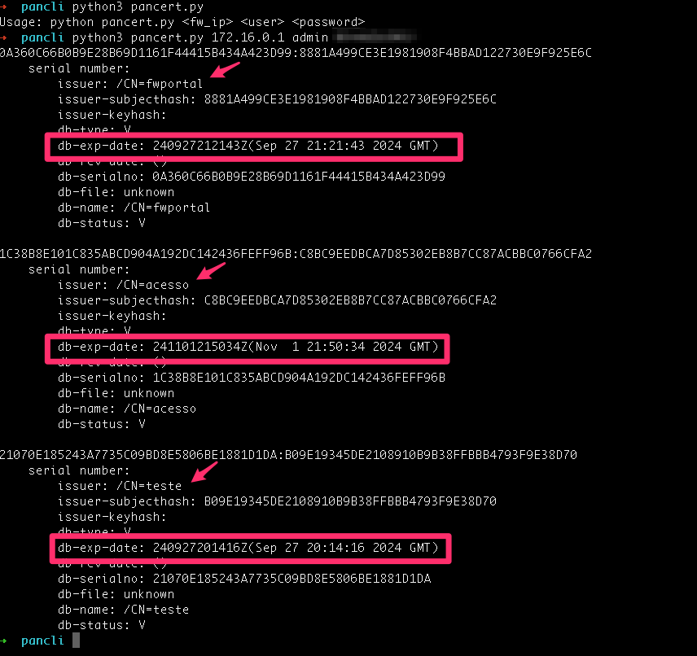

# PANOS API (Python SDK)

Example for fetching certificate information like the expiration date using Python SDK.&#x20;

### Installation

```bash
pip install pan-os-python
```



### Example Script

```python
import xml.etree.ElementTree as ET
from panos import firewall
import sys

if len(sys.argv) != 4:
    print("Usage: python3 pancert.py <fw_ip> <user> <password>")
    sys.exit(1)

fw = firewall.Firewall(sys.argv[1], sys.argv[2], sys.argv[3])
element_response = fw.op('show system info')
xml_response = fw.op('show sslmgr-store config-certificate-info', xml=True)

root = ET.fromstring(xml_response)
for result in root.findall(".//result"):
    print(result.text.strip())
```

### Result

\


<figure><figcaption></figcaption></figure>
